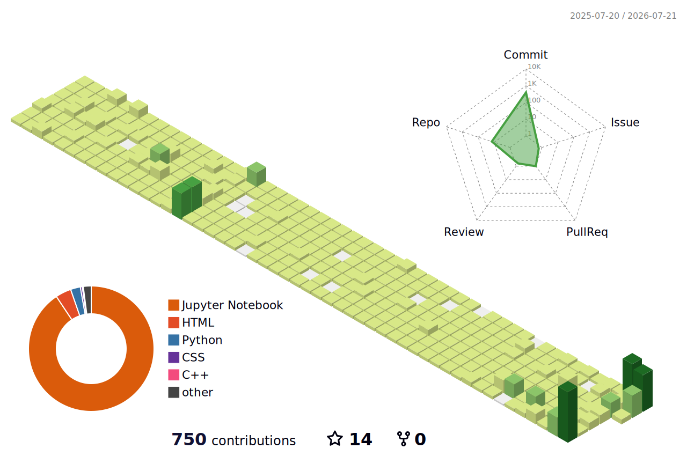

# Muhammad Tausif

**PhD Researcher (AI) building Adaptive GraphRAG for Information Retrieval · Founder, SoftAsia Tech & AI Smart School**

### Who / what / where I am right now

PhD candidate in Computer Science (AI) at **Quaid-i-Azam University, Islamabad** — comprehensive exam cleared, currently building an **Adaptive GraphRAG pipeline for Information Retrieval Systems**, the paper that gates my degree. Outside the PhD I run **SoftAsia Tech** (practical AI systems, built to ship) and **AI Smart School** (K-12, Pakistan), and spent years before that in agent-based simulation research, enterprise DevOps/QA, and full-stack freelance delivery.

- 🔭 **Currently:** writing and evaluating the GraphRAG experimental harness, targeting a W-category journal submission.
- 🧪 **Research background:** MSCS in Simulation & Modeling — agent-based modeling (NetLogo) of population/migration dynamics, years before "agentic AI" was a buzzword.
- 🛠️ **Delivery background:** QA automation (Gartner), DevOps (Python/Terraform/AWS/Grafana), full-stack web, Fiverr & Upwork Top Rated freelance history.
- 💬 **Talk to me about:** GraphRAG/RAG evaluation, agent-based modeling, or turning research prototypes into shipped tools.
- 📫 **Reach me:** tausifasia@gmail.com or [LinkedIn](https://www.linkedin.com/in/muhammed-tausif/).

### Tech stack

**AI / Research**

**Simulation & Modeling**

**Systems & Web**

### Selected projects

| Project | Why it's here |
|---|---|
| 🚧 **Adaptive GraphRAG** *(publishing soon)* | PhD research artifact — code goes public alongside the paper submission. This is the main thing I'm building right now. |
| [**Spendly**](https://github.com/MuhammadTausif/Spendly) | Expense-tracking app, built with Claude Code — a real, working example of my current AI-assisted dev workflow, not a toy demo. |
| [**AI E-Learning**](https://github.com/MuhammadTausif/ai-e-learning) | A framework for AI-driven learning goals — the R&D line that feeds directly into how AI Smart School is built. |
| [**Smart Education System**](https://github.com/MuhammadTausif/smart-education-system) | Automates school/classroom operations end-to-end, not just content delivery. |
| [**Upwork Productivity Manager**](https://github.com/MuhammadTausif/upwork-productivity-manager) | A Chrome extension I built and actually use to track my own freelance productivity. |
| [**ABscape**](https://github.com/SoftAsia-Tech/ABscape) | NetLogo agent-based model built from Java — the simulation work that predates and informs the current PhD research. |

*(157+ repositories total — [full list here](https://github.com/MuhammadTausif?tab=repositories). The six above are the ones that actually represent current work.)*

### Activity & stats

<picture>
  <source media="(prefers-color-scheme: dark)" srcset="./profile-3d-contrib/profile-night-rainbow.svg">
  <source media="(prefers-color-scheme: light)" srcset="./profile-3d-contrib/profile-green-animate.svg">
  
</picture>

**SoftAsia Tech:** [softasia.tech](https://softasia.tech) · [GitHub org](https://github.com/SoftAsia-Tech) &nbsp;|&nbsp;
**AI Smart School:** [ai-smart-schools.com](https://ai-smart-schools.com) &nbsp;|&nbsp;
**Kaggle:** [muhammedtausif](https://www.kaggle.com/muhammedtausif) &nbsp;|&nbsp;
**Email:** tausifasia@gmail.com

